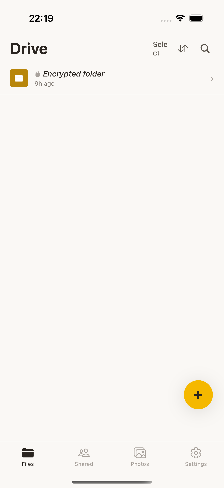
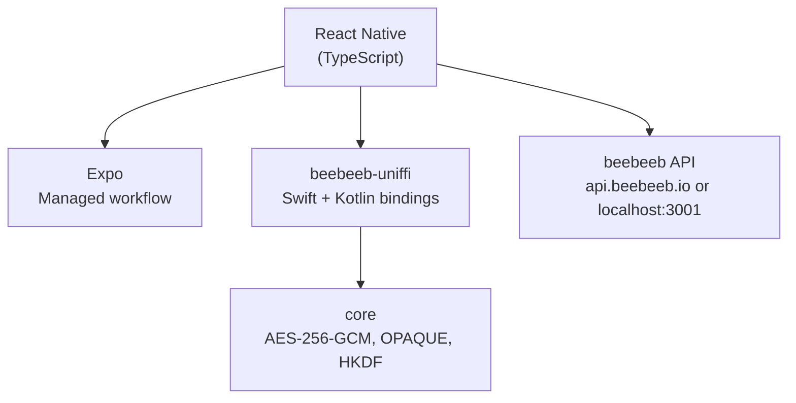

<p align="center">
  <a href="https://beebeeb.io"></a>
</p>
<h1 align="center">beebeeb mobile</h1>
<p align="center">End-to-end encrypted cloud storage for iOS and Android.</p>
<p align="center"><strong>We can't recover your data. Not even if we wanted to.</strong> That's the point.</p>
<p align="center">
  <a href="https://github.com/beebeeb-io/mobile/actions/workflows/ci.yml"></a> &nbsp;
  <a href="LICENSE"></a> &nbsp;
   &nbsp;
  <a href="SECURITY.md"></a>
</p>
<p align="center"><a href="https://beebeeb.io">Website</a> &nbsp;·&nbsp; <a href="https://beebeeb.io/security">How it works</a> &nbsp;·&nbsp; <a href="SECURITY.md">Report a vulnerability</a></p>
<p align="center"><sub>End-to-end encrypted cloud storage, built in Europe. Operated by Initlabs B.V., Wijchen, Netherlands.</sub></p>

---

<p align="center">
  
</p>

> **In active development.** Core screens and navigation are implemented. Crypto integration (UniFFI) and camera backup are in progress.

The [beebeeb](https://beebeeb.io) mobile app — browse, preview, back up, and share your encrypted files from your phone. All encryption runs natively via UniFFI bindings to [core](https://github.com/beebeeb-io/core) (Swift on iOS, Kotlin on Android), not in JavaScript. The master key never leaves Rust and the keychain; the server only ever sees ciphertext.

## Features (planned and in progress)

- **File browser** — navigate folders, pinned folders, recent files
- **Photos** — date-grouped grid with camera backup
- **File preview** — images and PDFs rendered natively
- **Sharing** — bottom sheet with link settings and permission controls
- **Biometric lock** — Face ID and fingerprint authentication
- **Offline access** — pinned files available without connectivity
- **Push notifications** — share invitations, sync status, storage alerts

## Tech stack

| Layer | Technology |
|---|---|
| Framework | React Native |
| Platform | Expo (managed workflow) |
| Language | TypeScript |
| Navigation | React Navigation 7 (bottom tabs + native stack) |
| Secure storage | expo-secure-store |
| Crypto | [core](https://github.com/beebeeb-io/core) via UniFFI (native speed, not JS) |
| Package manager | Bun |

## Platform support

| Platform | Minimum version |
|---|---|
| iOS | 16+ |
| Android | 12+ |

## Architecture



Encryption runs at native speed through UniFFI-generated bindings. The React Native layer handles UI and API calls; all cryptographic operations are delegated to the Rust core compiled for each platform's architecture.

## Getting started

### Prerequisites

- [Bun](https://bun.sh) (latest)
- [Expo CLI](https://docs.expo.dev/get-started/installation/)
- iOS Simulator (macOS) or Android emulator, or a device with [Expo Go](https://expo.dev/go)
- The [beebeeb API server](https://github.com/beebeeb-io/server), either production at `https://api.beebeeb.io` or a local server on `localhost:3001`

### Install and run

```sh
git clone https://github.com/beebeeb-io/mobile.git
cd mobile
bun install
bunx expo start
```

Press `i` for iOS Simulator, `a` for Android emulator, or scan the QR code with Expo Go.

### API environment

The checked-in simulator/dev-client default is `https://api.beebeeb.io` via `app.json` `expo.extra.apiUrl`, so local QA builds target the production API unless `EXPO_PUBLIC_API_URL` is set. The active target is shown in `Settings → About` as `API environment`, with the full URL below it, and is also logged at runtime as `[Beebeeb] API environment: …`.

Target the production API for beta-account QA:

```sh
bunx expo start --dev-client --host localhost --clear
```

Target a local server only when intentionally testing against one:

```sh
EXPO_PUBLIC_API_URL=http://localhost:3001 bunx expo start --dev-client --host localhost --clear
```

For Android emulator local API mode, use `EXPO_PUBLIC_API_URL=http://10.0.2.2:3001`.

### Platform-specific commands

```sh
bunx expo start --ios       # iOS Simulator
bunx expo start --android   # Android emulator
```

### iOS builds

iOS builds run locally on macOS (free on Apple Silicon — see `CLAUDE.md`):

```sh
eas build --platform ios --profile production --local --output ./build/beebeeb.ipa
eas submit --platform ios --path ./build/beebeeb.ipa
```

## Project structure

```
src/
  App.tsx               Root component, navigation setup
  api.ts                API client (same endpoints as web)
  theme.ts              Design tokens (RGB, converted from web's OKLCH)
  screens/
    FilesScreen.tsx      Files tab — pinned folders, recent files
    SharedScreen.tsx     Shared tab — files shared with you
    PhotosScreen.tsx     Photos tab — date grid, auto-backup
    SettingsScreen.tsx   Settings tab — security, backup, config
    PreviewScreen.tsx    File preview — PDF, images, with actions
```

## Current status

| Area | Status |
|---|---|
| Navigation and screens | Done |
| Design tokens and theming | Done |
| API client | Done |
| UniFFI crypto integration | In progress |
| Camera backup | In progress |
| Share extension | Planned |
| Offline mode | Planned |

## Security

Found a vulnerability? Email **security@beebeeb.io** — see [SECURITY.md](SECURITY.md).

## Part of beebeeb

End-to-end encrypted, zero-knowledge cloud storage — made in Europe.
[core](https://github.com/beebeeb-io/core) · [cli](https://github.com/beebeeb-io/cli) · [web](https://github.com/beebeeb-io/web) · [mobile](https://github.com/beebeeb-io/mobile) · [desktop](https://github.com/beebeeb-io/desktop) · [website](https://beebeeb.io)

## License

[AGPL-3.0-or-later](LICENSE) — © Initlabs B.V. (KvK 95157565), Wijchen, Netherlands.
