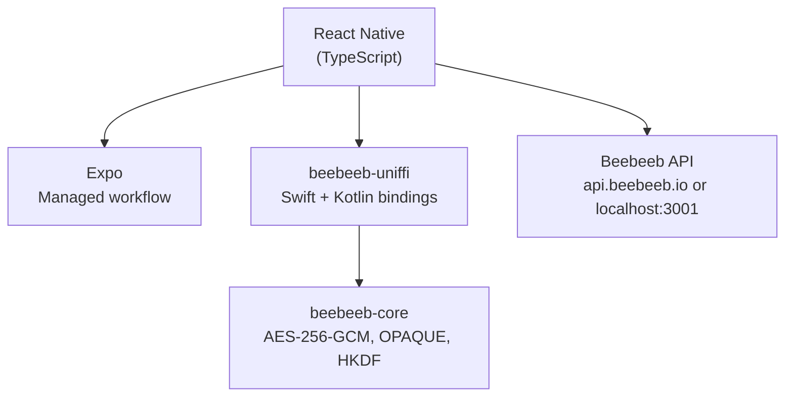

<p align="center">
  
</p>
<h3 align="center">Beebeeb Mobile</h3>
<p align="center">End-to-end encrypted cloud storage for iOS and Android.</p>

<p align="center">
  <a href="https://github.com/beebeeb-io/mobile/blob/main/LICENSE"></a>
  <a href="https://github.com/beebeeb-io/mobile/actions"></a>
  <a href="https://github.com/beebeeb-io/mobile/stargazers"></a>
</p>

---

> **In active development.** Core screens and navigation are implemented. Crypto integration (UniFFI) and camera backup are in progress.

The [Beebeeb](https://beebeeb.io) mobile app -- browse, preview, and share your encrypted files from your phone. All encryption runs natively via UniFFI bindings to [beebeeb-core](https://github.com/beebeeb-io/core) (Swift on iOS, Kotlin on Android), not in JavaScript.

Built and operated by [Initlabs B.V.](https://initlabs.nl), Wijchen, Netherlands.

## Features (planned and in progress)

- **File browser** -- navigate folders, pinned folders, recent files
- **Photos** -- date-grouped grid with camera backup indicator
- **File preview** -- images and PDFs rendered natively
- **Sharing** -- bottom sheet with link settings, permission controls
- **Biometric lock** -- Face ID and fingerprint authentication
- **Offline access** -- pinned files available without connectivity
- **Push notifications** -- share invitations, sync status, storage alerts

## Tech stack

| Layer | Technology |
|---|---|
| Framework | React Native |
| Platform | Expo (managed workflow) |
| Language | TypeScript |
| Navigation | React Navigation 7 (bottom tabs + native stack) |
| Secure storage | expo-secure-store |
| Crypto | [beebeeb-core](https://github.com/beebeeb-io/core) via UniFFI (native speed, not JS) |
| Package manager | Bun |

## Platform support

| Platform | Minimum version |
|---|---|
| iOS | 16+ |
| Android | 12+ |

## Architecture



Encryption runs at native speed through UniFFI-generated bindings. The React Native layer handles UI and API calls; all cryptographic operations are delegated to the Rust core compiled for each platform's architecture.

## Getting started

### Prerequisites

- [Bun](https://bun.sh) (latest)
- [Expo CLI](https://docs.expo.dev/get-started/installation/)
- iOS Simulator (macOS) or Android emulator, or a device with [Expo Go](https://expo.dev/go)
- The [Beebeeb API server](https://github.com/beebeeb-io/server), either production at `https://api.beebeeb.io` or a local server on `localhost:3001`

### Install and run

```sh
git clone https://github.com/beebeeb-io/mobile.git
cd mobile
bun install
bunx expo start
```

Press `i` for iOS Simulator, `a` for Android emulator, or scan the QR code with Expo Go.

### API environment

The checked-in simulator/dev-client default is `https://api.beebeeb.io` via `app.json` `expo.extra.apiUrl`, so XcodeBuildMCP and local QA builds target the production API unless `EXPO_PUBLIC_API_URL` is set. The active target is shown in `Settings` -> `About` as `API environment`, with the full URL below it, and is also logged at runtime as `[Beebeeb] API environment: ...`.

Use production API mode for beta-account QA:

```sh
bunx expo start --dev-client --host localhost --clear
```

Use local API mode only when intentionally testing against a local server:

```sh
EXPO_PUBLIC_API_URL=http://localhost:3001 bunx expo start --dev-client --host localhost --clear
```

For Android emulator local API mode, use `EXPO_PUBLIC_API_URL=http://10.0.2.2:3001`.

### Platform-specific commands

```sh
bunx expo start --ios       # iOS Simulator
bunx expo start --android   # Android emulator
```

## Project structure

```
src/
  App.tsx               Root component, navigation setup
  api.ts                API client (same endpoints as web)
  theme.ts              Design tokens (RGB, converted from web's OKLCH)
  screens/
    FilesScreen.tsx      Files tab -- pinned folders, recent files
    SharedScreen.tsx     Shared tab -- files shared with you
    PhotosScreen.tsx     Photos tab -- date grid, auto-backup
    SettingsScreen.tsx   Settings tab -- security, backup, config
    PreviewScreen.tsx    File preview -- PDF, images, with actions
```

## Current status

| Area | Status |
|---|---|
| Navigation and screens | Done |
| Design tokens and theming | Done |
| API client | Done |
| UniFFI crypto integration | In progress |
| Camera backup | Planned |
| Share extension | Planned |
| Offline mode | Planned |

## Security

Crypto will run natively on-device via UniFFI bindings to `beebeeb-core`. The server never has access to your keys or plaintext data.

If you discover a security vulnerability, please email [security@beebeeb.io](mailto:security@beebeeb.io). We aim to acknowledge reports within 48 hours.

## Contributing

Contributions are welcome.

1. Fork the repository
2. Create a feature branch (`git checkout -b feat/your-feature`)
3. Make your changes
4. Ensure pre-commit hooks pass (secret scanning)
5. Open a pull request against `main`

## Part of Beebeeb

| Repository | Description |
|---|---|
| [core](https://github.com/beebeeb-io/core) | Cryptographic core, shared types, sync engine |
| [cli](https://github.com/beebeeb-io/cli) | `bb` -- CLI for encrypted cloud storage |
| [desktop](https://github.com/beebeeb-io/desktop) | Desktop sync for macOS, Windows, Linux |
| [web](https://github.com/beebeeb-io/web) | Web client |
| **[mobile](https://github.com/beebeeb-io/mobile)** | iOS and Android app (you are here) |

## License

[GNU Affero General Public License v3.0](./LICENSE)

Copyright (c) Initlabs B.V.

---

[beebeeb.io](https://beebeeb.io) -- [GitHub](https://github.com/beebeeb-io)
